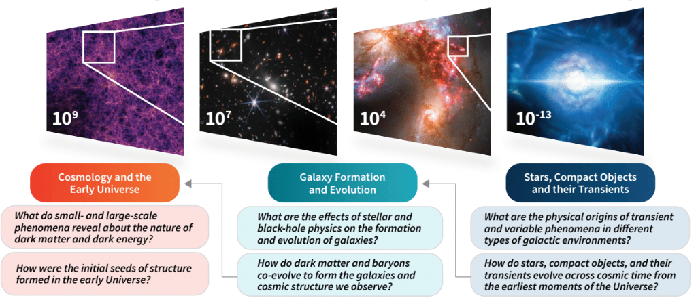

## Background
Astronomical surveys of unprecedented scale, from the Vera C. Rubin Observatory to the CMB–Stage 4 
experiment, promise transformational advances in astrophysics and cosmology. Boundary-pushing discoveries
will be realized across astronomy, from stars and black holes to galaxies to the largest scales and the earliest
moments in the Universe. Fulfilling this promise requires overcoming enormous challenges in analyzing
very large, heterogeneous datasets; in developing physically accurate simulations that span a vast range of
scales to interpret those data; and in designing ever more complex astronomical instruments and surveys.
Addressing these emerging challenges requires that we leverage the fast-paced revolution in 
Artificial Intelligence. 

## Vision
Bringing together 25 partner organizations, we are establishing the SkAI Institute, an
inclusive, cross-disciplinary nexus that will synergistically accelerate Astro-AI research and help educate
a diverse Astro-AI workforce. Centrally located in Chicago and the Midwest with research and education
bridges to Georgia, Hawaii and Alaska, SkAI will bring together astrophysicists, foundational AI researchers, 
educators, AI-ethicists, software engineers, and artists to: 

1. Confront the challenges posed by transformative multi-wavelength and multi-messenger surveys. 

2. Develop innovative, trustworthy AI tools for the research community. 

3. Seed and nurture a diverse generation of interdisciplinary leaders in science and engineering to ethically apply and extend AI within and beyond academia.

## Research
Driven by upcoming astronomy surveys, the SkAI Institute will overcome critical challenges in three
astrophysics research areas:
**Stars, Compact Objects and their Transients**,
**Galaxy Formation and Evolution**, and
**Cosmology and the Early Universe**. Our work is motivated by and connected
through six key questions spanning more than 20 orders of magnitude in scales of time and space:

Advances in foundational AI (fAI), especially those driven by deep neural networks, are urgently needed
to address the astrophysics challenges posed by large surveys; SkAI’s Astro-AI interdisciplinary teams
will build the requisite technical capabilities by pursuing innovations that span three critical fAI areas.

**Generative Models** will provide a scalable learning paradigm in which the primary objective is to
output new samples from a distribution known only via a collection of training samples.
 Such models be trained without expensive labeling and will fuel many machine-learning tasks. We will expand the
current forefront of these approaches by accounting for multi-modal data, mode collapse, and the treatment
of rare events critical to discovering astrophysical phenomena. We will also leverage generative models
for astronomy tasks such as missing data imputation, image reconstruction, and simulation acceleration.

Overcoming the inscrutable nature of current deep generative models to enable physically interpretable
scientific analyses will require fundamental advances in our second fAI area, 
**Astrophysics-Informed and Interpretable Architectures**. New techniques for weaving sophisticated astrophysical guidance (not
just straightforward symmetries and constraints) into the structure of models are paramount to ensuring
that such systems produce physically consistent predictions. 

Our third fAI area, **Uncertainty Quantification** is critical to validate the reliability of model outputs, guide learning with few labels, and derive
reliable astrophysical predictions. Distribution-free predictive inference, Bayesian methods, 
and data assimilation must be integrated into learning systems to generate informative and actionable
uncertainty estimates.

SkAI will realize advances in each fAI area to open new paths to answering key
astronomy questions. Combined, these areas will advance trustworthy AI systems that leverage domain
knowledge and simulations alongside large-scale observational data. The intentional, cross-disciplinary
approach adopted by the SkAI Institute will transform discovery, simulations, and experimental design
across astrophysics and accelerate advances in other natural sciences.

